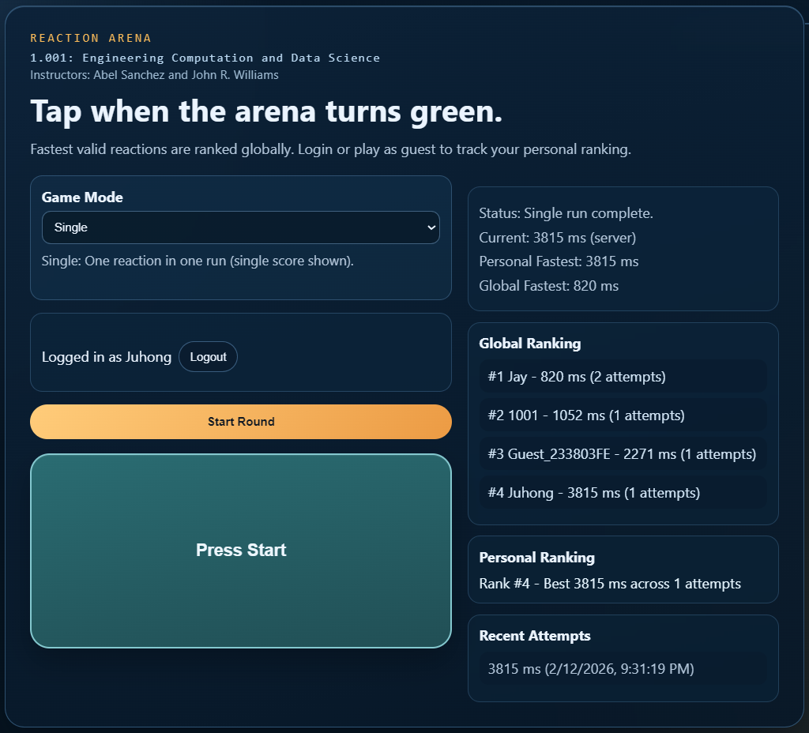

# reactionTimer2026

## Project Statement
> "You need to develop a reaction timer app to test reaction times and record the fastest. You will need a server that serves up a web page. Think through how the timer is “fair”. Consider how to deal with someone who rapidly keeps clicking, or uses some other mechanism to “cheat” your system."

## App Screenshot


## Project Statement Policy
- The `Project Statement` section is immutable.
- Do not edit, paraphrase, shorten, or expand the statement text in any project file.
- If copied to another file, it must remain verbatim.

## Project Statement Alignment
- "develop a reaction timer app to test reaction times and record the fastest":
  - The app measures reaction rounds and stores fastest records in SQLite.
- "You will need a server that serves up a web page":
  - Node.js + Express serves the SPA from `public/` and provides gameplay/auth APIs.
- "Think through how the timer is fair":
  - Timing validation is server-authoritative: trigger window is set on `/api/start`, accepted reaction time is computed on `/api/submit`.
- "deal with someone who rapidly keeps clicking ... or uses some other mechanism to cheat":
  - Anti-cheat controls include start/submit rate limiting, guest creation cooldown + daily cap, single-use test sessions, session ownership checks, and validation/expiry bounds.

## Technical Framework
- Runtime & Server: Node.js + Express
- Architecture: Single Page Application (SPA) with vanilla HTML/CSS/JS
- Data Layer: SQLite (`data/reaction_timer.db`)
- Authentication: Register/Login/Guest/Logout with HTTP-only cookie sessions

## Features
- Account or guest gameplay (players can login or start a guest session).
- SQLite persistence for users, auth sessions, test sessions, scores, and audit logs.
- Server-authoritative reaction validation:
  - server sets trigger window on `/api/start`
  - server computes accepted reaction time on `/api/submit`
- Anti-cheat controls:
  - rate limiting for starts/submissions
  - guest session creation cooldown + daily per-client cap
  - single-use test sessions
  - session ownership checks
  - expiry and validation bounds
- Ranking and score views:
  - mode-separated personal/global fastest
  - global leaderboard (always visible)
  - personal ranking (shown when logged in)
  - mode-separated recent history
  - `Multiple` mode ranking/score is based on sum of attempts in a run
- Fun layer:
  - mode selection (`Single`, `Multiple`)
  - multiple mode runs several reaction attempts in one run
  - combo, points, and level progression
  - live challenge tracker for session goals

## Fairness & Anti-Cheat Mechanisms
This section summarizes the fairness model and anti-cheat controls designed to ensure reliable scoring integrity.

| Risk / Cheating Behavior | Control Implemented | Where It Is Enforced |
| :--- | :--- | :--- |
| Clicking before the trigger (“too soon”) | Server checks `now < trigger_time` and rejects submission | `POST /api/submit` |
| Client fakes reaction timing | Server computes accepted reaction time from server timestamps, not trusting client-reported value | `POST /api/start`, `POST /api/submit` |
| UI/server trigger desync causing false outcomes | Client uses server-returned `wait_ms` for trigger display timing | `/api/start` response + `public/app.js` |
| Rapid repeated start/submit requests (spam clicking/scripts) | Rate limiting on start and submit actions | `POST /api/start`, `POST /api/submit` |
| Reusing a session or submitting multiple times for one round | Single-use test session status (`active` -> `submitted/rejected/expired`) | `test_sessions` + `POST /api/submit` |
| Submitting from another user/session context | Auth required + session ownership + client key validation | `requireAuth`, `POST /api/start`, `POST /api/submit` |
| Submitting old/stale sessions | Session TTL and expiry checks before accepting score | `POST /api/submit` |
| Impossible/bot-like reaction values | Validation bounds (`MIN_REACTION_MS`, `MAX_REACTION_MS`) | `POST /api/submit` |
| Guest account spam to pollute rankings | Guest creation cooldown + 24h per-client cap + audit events for blocked attempts | `POST /api/guest`, `audit_logs` |
| Hidden manipulation without trace | Security-relevant actions are written to audit logs | `audit_logs` writes in auth/game flows |

### Fairness Outcome
- Rankings and fastest scores are based on server-validated submissions only.
- Premature clicks, replayed sessions, and out-of-bounds reactions are excluded from valid scoring.
- Anti-abuse controls reduce automated and high-frequency cheating behavior while preserving playability.

## Project Structure
- `server.js`: Express API + SQLite initialization + auth/game logic
- `public/index.html`: SPA markup including auth/game UI
- `public/styles.css`: UI styling
- `public/app.js`: client-side auth and reaction flow
- `data/`: runtime SQLite database directory
- `docs/`: planning/evaluation documents

## API Endpoints
- Auth
  - `POST /api/register`
  - `POST /api/login`
  - `POST /api/guest`
  - `POST /api/logout`
  - `GET /api/me`
- Gameplay
  - `POST /api/start` (auth required)
  - `POST /api/submit` (auth required)
  - `GET /api/fastest?mode=class|multiple`
  - `GET /api/leaderboard?mode=class|multiple`
  - `GET /api/history?mode=class|multiple` (auth required)

## Run Locally
1. Install dependencies:
   ```bash
   npm install
   ```
2. Start server:
   ```bash
   npm start
   ```
3. Open app:
   ```
   http://localhost:3000
   ```

## Lighthouse Test Summary
- Test context:
  - `Navigation` mode is not suitable for this workflow because this project is a SPA and interactive checks were run after in-app state changes.
  - Results below are from `Timespan` and `Snapshot` runs.
- Timespan result:
  - Performance: `6/6` audits passed
  - Best Practices: `8/8` audits passed
- Snapshot result:
  - Performance: `1/1` audits passed
  - Accessibility: `19/19` audits passed
  - Best Practices: `4/4` audits passed
  - SEO: `3/5` audits passed
- Interpretation:
  - Core runtime quality is strong for Performance, Accessibility, and Best Practices in the tested SPA flow.
  - Remaining improvement area is SEO in Snapshot checks.

## Notes
- SQLite DB files are runtime artifacts and are git-ignored.
- Current session cookie is configured for local development (`secure: false`); set secure cookies for HTTPS production.
